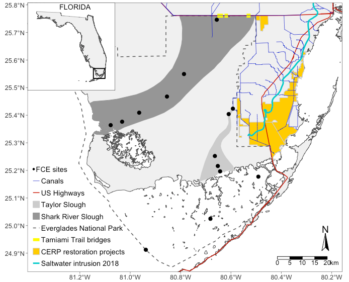
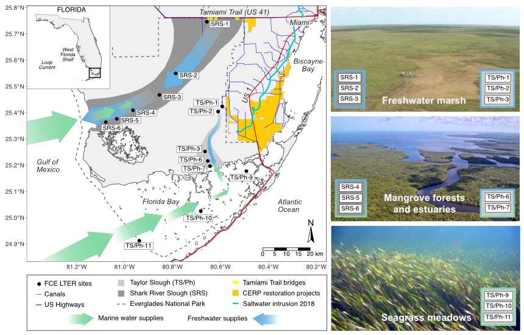

# FCE site map with a grayscale base layer
 \
Organization: Florida Coastal Everglades LTER Program\
Information Manager: Gabriel Kamener ([gkamener\@fiu.edu](mailto:gkamener@fiu.edu))\
Site Manager: Michael Rugge ([ruggem\@fiu.edu](mailto:ruggem@fiu.edu))\
Lead Principal Investigator: John Kominoski ([jkominos\@fiu.edu](mailto:jkominos@fiu.edu))\
Website: <https://fcelter.fiu.edu>\
GitHub site: <https://github.com/FCE-LTER>\
 \
Initial maps were created in R. Affinity Designer was used to add the following elements to map.

* Site labels
* Labels for the Gulf of Mexico, Atlantic Ocean, Florida Bay, Biscayne bay, Tamiami Trail, US 1, Miami, Loop Current, and West Florida Shelf
* Modified legend
* Arrows showing freshwater and marine flow
* Photos of habitats \

Maps exported from R and Affinity Designer as png, EPS, and PDF files are in the exported_maps directory. \

Please contact Mike Rugge ([ruggem\@fiu.edu)](mailto:ruggem@fiu.edu) with questions about the maps. \
 \
**FCE map created using the FCE_map_grayscale_base.R script**
 \
 \

 \
 \
**FCE map created using Affinity Designer**
 \
 \

  

